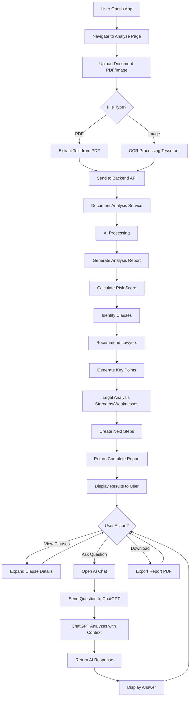
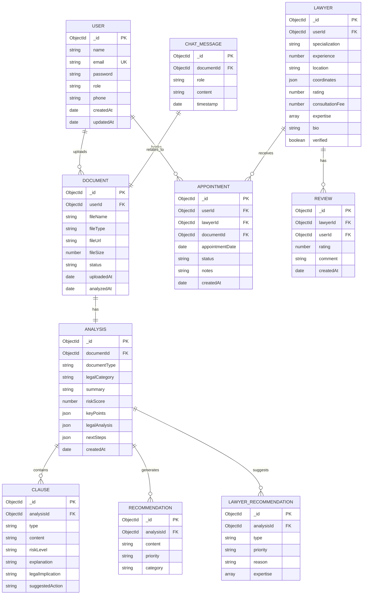

# 🤖 AI Legal Document Analyzer - System Architecture & Workflows

## 📋 Table of Contents
1. [System Overview](#system-overview)
2. [Complete Workflow Diagram](#complete-workflow-diagram)
3. [Entity Relationship Diagrams](#entity-relationship-diagrams)
4. [Component Architecture](#component-architecture)
5. [Data Flow Diagrams](#data-flow-diagrams)
6. [API Workflow](#api-workflow)
7. [ChatGPT Integration Flow](#chatgpt-integration-flow)

---

## 🎯 System Overview

The AI Legal Document Analyzer is a full-stack web application that analyzes legal documents using AI and provides:
- Automatic document analysis
- Risk assessment
- Lawyer recommendations
- AI-powered chat assistance
- Comprehensive legal reports

### **Technology Stack:**
```
Frontend:  React + Vite + Framer Motion
Backend:   Node.js + Express
Database:  MongoDB Atlas
AI:        OpenAI GPT-3.5-turbo
OCR:       Python + Tesseract
```

---

## 📊 Complete Workflow Diagram

### **End-to-End User Journey:**



---

## 🗂️ Entity Relationship Diagrams

### **1. Database Schema:**



---

## 🏗️ Component Architecture

### **System Architecture Diagram:**

```
┌─────────────────────────────────────────────────────────────┐
│                        CLIENT LAYER                         │
│  ┌─────────────────────────────────────────────────────┐   │
│  │              React Frontend (Vite)                  │   │
│  │  ┌──────────┐  ┌──────────┐  ┌──────────────────┐  │   │
│  │  │  Home    │  │ Analyze  │  │ Lawyer Dashboard │  │   │
│  │  │  Page    │  │  Page    │  │      Page        │  │   │
│  │  └──────────┘  └──────────┘  └──────────────────┘  │   │
│  │  ┌──────────┐  ┌──────────┐  ┌──────────────────┐  │   │
│  │  │  Login   │  │ Register │  │   Appointments   │  │   │
│  │  │  Page    │  │  Page    │  │      Page        │  │   │
│  │  └──────────┘  └──────────┘  └──────────────────┘  │   │
│  └─────────────────────────────────────────────────────┘   │
│                           ↕                                 │
│  ┌─────────────────────────────────────────────────────┐   │
│  │              API Service Layer (Axios)              │   │
│  └─────────────────────────────────────────────────────┘   │
└─────────────────────────────────────────────────────────────┘
                            ↕ HTTP/REST
┌─────────────────────────────────────────────────────────────┐
│                        SERVER LAYER                         │
│  ┌─────────────────────────────────────────────────────┐   │
│  │           Express.js Backend Server                 │   │
│  │  ┌──────────────────────────────────────────────┐   │   │
│  │  │              Route Handlers                  │   │   │
│  │  │  /api/auth  /api/documents  /api/lawyers    │   │   │
│  │  │  /api/appointments  /api/chat  /api/admin   │   │   │
│  │  └──────────────────────────────────────────────┘   │   │
│  │                       ↕                              │   │
│  │  ┌──────────────────────────────────────────────┐   │   │
│  │  │              Controllers                     │   │   │
│  │  │  authController  documentController          │   │   │
│  │  │  lawyerController  chatController            │   │   │
│  │  └──────────────────────────────────────────────┘   │   │
│  │                       ↕                              │   │
│  │  ┌──────────────────────────────────────────────┐   │   │
│  │  │              Services                        │   │   │
│  │  │  chatgptService  documentService             │   │   │
│  │  │  geocodingService  emailService              │   │   │
│  │  └──────────────────────────────────────────────┘   │   │
│  │                       ↕                              │   │
│  │  ┌──────────────────────────────────────────────┐   │   │
│  │  │              Middleware                      │   │   │
│  │  │  auth  errorHandler  validation              │   │   │
│  │  └──────────────────────────────────────────────┘   │   │
│  └─────────────────────────────────────────────────────┘   │
└─────────────────────────────────────────────────────────────┘
           ↕                    ↕                    ↕
┌──────────────────┐  ┌──────────────────┐  ┌──────────────────┐
│  MongoDB Atlas   │  │   OpenAI API     │  │   OCR Service    │
│   (Database)     │  │  (ChatGPT 3.5)   │  │   (Tesseract)    │
│                  │  │                  │  │                  │
│  • Users         │  │  • Chat          │  │  • Image to Text │
│  • Documents     │  │  • Analysis      │  │  • PDF Extract   │
│  • Lawyers       │  │  • Context       │  │                  │
│  • Appointments  │  │                  │  │                  │
└──────────────────┘  └──────────────────┘  └──────────────────┘
```

---

## 🔄 Data Flow Diagrams

### **1. Document Upload & Analysis Flow:**

```
┌─────────────┐
│    User     │
└──────┬──────┘
       │ 1. Upload Document
       ↓
┌─────────────────────┐
│  Analyze.jsx        │
│  (React Component)  │
└──────┬──────────────┘
       │ 2. onDrop(file)
       │ 3. setFile(file)
       │ 4. analyzeDocument(file)
       ↓
┌─────────────────────┐
│  FormData Creation  │
│  file + metadata    │
└──────┬──────────────┘
       │ 5. POST /api/documents/upload
       ↓
┌─────────────────────────────┐
│  Backend: documentRoutes    │
│  router.post('/upload')     │
└──────┬──────────────────────┘
       │ 6. multer middleware
       │    (file upload)
       ↓
┌─────────────────────────────┐
│  documentController         │
│  uploadDocument()           │
└──────┬──────────────────────┘
       │ 7. Save file to disk
       │ 8. Create Document record
       ↓
┌─────────────────────────────┐
│  MongoDB                    │
│  documents collection       │
└──────┬──────────────────────┘
       │ 9. Document saved
       ↓
┌─────────────────────────────┐
│  Analysis Service           │
│  analyzeDocument()          │
└──────┬──────────────────────┘
       │ 10. Extract text
       │ 11. Process with AI
       │ 12. Generate report
       ↓
┌─────────────────────────────┐
│  Analysis Data:             │
│  • Document Type            │
│  • Risk Score               │
│  • Clauses                  │
│  • Lawyer Recommendations   │
│  • Key Points               │
│  • Legal Analysis           │
│  • Next Steps               │
└──────┬──────────────────────┘
       │ 13. Save to MongoDB
       ↓
┌─────────────────────────────┐
│  MongoDB                    │
│  analysis collection        │
└──────┬──────────────────────┘
       │ 14. Return to frontend
       ↓
┌─────────────────────────────┐
│  Analyze.jsx                │
│  setResult(analysis)        │
└──────┬──────────────────────┘
       │ 15. Render UI
       ↓
┌─────────────────────────────┐
│  Display Results:           │
│  ✓ Summary Card             │
│  ✓ Lawyer Recommendations   │
│  ✓ Key Points               │
│  ✓ Legal Analysis           │
│  ✓ Clauses                  │
│  ✓ Recommendations          │
│  ✓ Next Steps               │
└─────────────────────────────┘
```

---

### **2. ChatGPT Integration Flow:**

```
┌─────────────┐
│    User     │
└──────┬──────┘
       │ 1. Click "Ask AI"
       │ 2. Type question
       ↓
┌─────────────────────────────┐
│  Chat Interface             │
│  (Analyze.jsx)              │
└──────┬──────────────────────┘
       │ 3. sendChatMessage()
       │ 4. Add user message to state
       ↓
┌─────────────────────────────┐
│  API Request                │
│  POST /api/chat/document    │
│                             │
│  Body:                      │
│  • documentAnalysis         │
│  • message                  │
│  • conversationHistory      │
└──────┬──────────────────────┘
       │ 5. Send to backend
       ↓
┌─────────────────────────────┐
│  Backend: chatRoutes        │
│  router.post('/document')   │
└──────┬──────────────────────┘
       │ 6. Route to controller
       ↓
┌─────────────────────────────┐
│  chatController             │
│  chatWithDoc()              │
└──────┬──────────────────────┘
       │ 7. Validate input
       │ 8. Call ChatGPT service
       ↓
┌─────────────────────────────┐
│  chatgptService             │
│  chatWithDocument()         │
└──────┬──────────────────────┘
       │ 9. Build system prompt
       │ 10. Add document context
       │ 11. Build messages array
       ↓
┌─────────────────────────────┐
│  System Prompt:             │
│                             │
│  "You are an expert legal   │
│   AI assistant analyzing    │
│   legal documents..."       │
│                             │
│  Document Context:          │
│  • Summary                  │
│  • Risk Score               │
│  • Clauses                  │
│  • Recommendations          │
└──────┬──────────────────────┘
       │ 12. Send to OpenAI
       ↓
┌─────────────────────────────┐
│  OpenAI API                 │
│  GPT-3.5-turbo              │
│                             │
│  Model: gpt-3.5-turbo       │
│  Temperature: 0.7           │
│  Max Tokens: 500            │
└──────┬──────────────────────┘
       │ 13. AI processes
       │ 14. Generate response
       ↓
┌─────────────────────────────┐
│  AI Response:               │
│                             │
│  "Based on my analysis of   │
│   your Service Agreement,   │
│   here are the main risks:  │
│                             │
│   🚨 High Risk:             │
│   1. Non-Compete Clause..." │
└──────┬──────────────────────┘
       │ 15. Return to service
       ↓
┌─────────────────────────────┐
│  chatgptService             │
│  Return response            │
└──────┬──────────────────────┘
       │ 16. Return to controller
       ↓
┌─────────────────────────────┐
│  chatController             │
│  Send JSON response         │
└──────┬──────────────────────┘
       │ 17. Return to frontend
       ↓
┌─────────────────────────────┐
│  Analyze.jsx                │
│  Add AI message to state    │
└──────┬──────────────────────┘
       │ 18. Render message
       ↓
┌─────────────────────────────┐
│  Chat UI                    │
│  Display AI response        │
└─────────────────────────────┘
```

---

## 🔌 API Workflow

### **API Endpoints & Flow:**

```
┌──────────────────────────────────────────────────────────┐
│                    API ENDPOINTS                         │
└──────────────────────────────────────────────────────────┘

1. AUTHENTICATION
   POST   /api/auth/register
   POST   /api/auth/login
   GET    /api/auth/me
   
   Flow: User → Register → JWT Token → Authenticated

2. DOCUMENT MANAGEMENT
   POST   /api/documents/upload
   GET    /api/documents
   GET    /api/documents/:id
   POST   /api/documents/:id/analyze
   DELETE /api/documents/:id
   
   Flow: Upload → Store → Analyze → Return Results

3. CHAT INTEGRATION
   POST   /api/chat/document
   
   Flow: Question → ChatGPT → Context-Aware Response

4. LAWYER MANAGEMENT
   GET    /api/lawyers
   GET    /api/lawyers/search
   GET    /api/lawyers/:id
   POST   /api/lawyers/register
   PUT    /api/lawyers/:id
   
   Flow: Search → Filter → Display Lawyers

5. APPOINTMENTS
   POST   /api/appointments
   GET    /api/appointments
   GET    /api/appointments/:id
   PUT    /api/appointments/:id
   DELETE /api/appointments/:id
   
   Flow: Book → Confirm → Manage

6. ADMIN
   GET    /api/admin/stats
   GET    /api/admin/users
   PUT    /api/admin/verify-lawyer/:id
   
   Flow: Admin → Manage → Verify
```

---

## 📈 Sequence Diagrams

### **Complete User Journey Sequence:**

```
User          Frontend        Backend         MongoDB      OpenAI       OCR
 │               │               │               │           │           │
 │ 1. Open App   │               │               │           │           │
 │──────────────>│               │               │           │           │
 │               │               │               │           │           │
 │ 2. Navigate   │               │               │           │           │
 │──────────────>│               │               │           │           │
 │               │               │               │           │           │
 │ 3. Upload Doc │               │               │           │           │
 │──────────────>│               │               │           │           │
 │               │ 4. POST       │               │           │           │
 │               │──────────────>│               │           │           │
 │               │               │ 5. Save       │           │           │
 │               │               │──────────────>│           │           │
 │               │               │<──────────────│           │           │
 │               │               │ 6. Extract    │           │           │
 │               │               │───────────────────────────────────────>│
 │               │               │<───────────────────────────────────────│
 │               │               │ 7. Analyze    │           │           │
 │               │               │──────────────>│           │           │
 │               │               │<──────────────│           │           │
 │               │ 8. Results    │               │           │           │
 │               │<──────────────│               │           │           │
 │ 9. Display    │               │               │           │           │
 │<──────────────│               │               │           │           │
 │               │               │               │           │           │
 │ 10. Ask AI    │               │               │           │           │
 │──────────────>│               │               │           │           │
 │               │ 11. POST Chat │               │           │           │
 │               │──────────────>│               │           │           │
 │               │               │ 12. ChatGPT   │           │           │
 │               │               │───────────────────────────>│           │
 │               │               │<───────────────────────────│           │
 │               │ 13. Response  │               │           │           │
 │               │<──────────────│               │           │           │
 │ 14. Show AI   │               │               │           │           │
 │<──────────────│               │               │           │           │
```

---

## 🎨 State Management Flow

### **React Component State:**

```
┌─────────────────────────────────────────────────────────┐
│              Analyze.jsx Component State                │
├─────────────────────────────────────────────────────────┤
│                                                         │
│  const [file, setFile] = useState(null)                │
│  const [preview, setPreview] = useState(null)          │
│  const [result, setResult] = useState(null)            │
│  const [analyzing, setAnalyzing] = useState(false)     │
│  const [chatMessages, setChatMessages] = useState([])  │
│  const [chatInput, setChatInput] = useState('')        │
│  const [chatLoading, setChatLoading] = useState(false) │
│  const [showChat, setShowChat] = useState(false)       │
│  const [expandedClauses, setExpandedClauses] = []      │
│                                                         │
└─────────────────────────────────────────────────────────┘
                           │
                           ↓
┌─────────────────────────────────────────────────────────┐
│                   State Transitions                     │
├─────────────────────────────────────────────────────────┤
│                                                         │
│  1. Initial State:                                      │
│     file = null, result = null                          │
│                                                         │
│  2. File Upload:                                        │
│     file = File, preview = URL                          │
│                                                         │
│  3. Analyzing:                                          │
│     analyzing = true                                    │
│                                                         │
│  4. Analysis Complete:                                  │
│     result = Analysis, analyzing = false                │
│                                                         │
│  5. Chat Opened:                                        │
│     showChat = true                                     │
│                                                         │
│  6. Message Sent:                                       │
│     chatMessages = [...prev, new], chatLoading = true   │
│                                                         │
│  7. AI Response:                                        │
│     chatMessages = [...prev, ai], chatLoading = false   │
│                                                         │
└─────────────────────────────────────────────────────────┘
```

---

## 🔐 Authentication Flow

```
┌─────────────┐
│    User     │
└──────┬──────┘
       │ 1. Enter credentials
       ↓
┌─────────────────────┐
│  Login Component    │
└──────┬──────────────┘
       │ 2. POST /api/auth/login
       ↓
┌─────────────────────┐
│  authController     │
│  login()            │
└──────┬──────────────┘
       │ 3. Validate credentials
       │ 4. Check password
       ↓
┌─────────────────────┐
│  bcrypt.compare()   │
└──────┬──────────────┘
       │ 5. Password valid
       ↓
┌─────────────────────┐
│  Generate JWT       │
│  jwt.sign()         │
└──────┬──────────────┘
       │ 6. Return token
       ↓
┌─────────────────────┐
│  Frontend           │
│  Store in localStorage
└──────┬──────────────┘
       │ 7. Set auth header
       ↓
┌─────────────────────┐
│  Axios interceptor  │
│  Add Bearer token   │
└──────┬──────────────┘
       │ 8. All requests authenticated
       ↓
┌─────────────────────┐
│  Protected Routes   │
│  Access granted     │
└─────────────────────┘
```

---

## 📊 Data Models

### **Document Analysis Data Structure:**

```javascript
{
  analysis: {
    // Basic Info
    summary: "Service Agreement between two parties...",
    documentType: "Service Agreement",
    overallRiskScore: 45,
    legalCategory: "Contract Law",
    subCategory: "Service Agreement / Employment",
    jurisdiction: "India",
    
    // Lawyer Recommendations
    recommendedLawyers: [
      {
        type: "Contract Lawyer",
        priority: "High",
        reason: "Primary expertise needed...",
        expertise: ["Contract Review", "Negotiation", "Drafting"]
      },
      {
        type: "Employment Lawyer",
        priority: "Medium",
        reason: "Non-compete clauses require...",
        expertise: ["Non-Compete Agreements", "Employment Terms"]
      }
    ],
    
    // Key Points
    keyPoints: [
      {
        title: "Document Purpose",
        content: "Service agreement establishing terms...",
        importance: "high"
      },
      {
        title: "Financial Obligations",
        content: "Monthly retainer of INR 50,000...",
        importance: "high"
      }
    ],
    
    // Legal Analysis
    legalAnalysis: {
      strengths: [
        "Clear payment terms with specific amounts",
        "Standard confidentiality provisions"
      ],
      weaknesses: [
        "Non-compete duration (24 months) is excessive",
        "Early termination penalty is heavily weighted"
      ],
      redFlags: [
        "⚠️ 24-month non-compete restriction",
        "⚠️ 2-month termination penalty"
      ]
    },
    
    // Clauses
    clauses: [
      {
        type: "Non-Compete",
        content: "During the term and for 24 months...",
        riskLevel: "high",
        explanation: "May restrict your future opportunities",
        legalImplication: "May not be fully enforceable...",
        suggestedAction: "Negotiate to reduce duration to 12 months"
      }
    ],
    
    // Recommendations
    recommendations: [
      "🔍 Consult a Contract Lawyer to review terms",
      "⚖️ Seek Employment Law expertise for non-compete"
    ],
    
    // Next Steps
    nextSteps: [
      {
        step: "Consult Lawyer",
        description: "Schedule consultation with Contract Lawyer",
        priority: "Immediate",
        timeframe: "Within 2-3 days"
      }
    ]
  }
}
```

---

## 🚀 Deployment Architecture

```
┌─────────────────────────────────────────────────────────┐
│                    PRODUCTION SETUP                     │
└─────────────────────────────────────────────────────────┘

┌──────────────┐      ┌──────────────┐      ┌──────────────┐
│   Vercel     │      │   Render     │      │ MongoDB      │
│  (Frontend)  │◄────►│  (Backend)   │◄────►│   Atlas      │
│              │      │              │      │ (Database)   │
│  React App   │      │  Express API │      │              │
└──────────────┘      └──────┬───────┘      └──────────────┘
                             │
                    ┌────────┴────────┐
                    │                 │
              ┌─────▼─────┐     ┌────▼─────┐
              │  OpenAI   │     │   AWS    │
              │    API    │     │    S3    │
              │ (ChatGPT) │     │ (Files)  │
              └───────────┘     └──────────┘
```

---

## 📝 Summary

This document provides a complete overview of:

✅ **System Architecture** - How components interact  
✅ **Database Schema** - Entity relationships  
✅ **Data Flow** - How data moves through the system  
✅ **API Workflow** - Endpoint structure and flow  
✅ **ChatGPT Integration** - AI chat implementation  
✅ **Authentication** - Security flow  
✅ **State Management** - React component states  

**Use this documentation to:**
- Understand the complete system
- Onboard new developers
- Plan future enhancements
- Debug issues
- Explain to stakeholders

---

**Created for:** AI Legal Document Analyzer  
**Version:** 1.0.0  
**Last Updated:** February 2026
